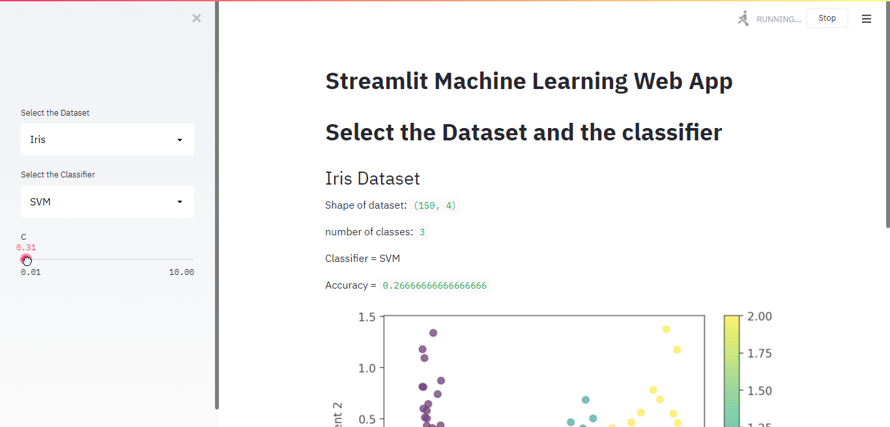

# Simple Machine Learning Web App

Simple WebApp created with streamlit and python to visualize 3 famous datasets(Iris, Wine and Breast Cancer) using 3 Machine Learning Classifiers(KNN, SVM and RandomForest)

